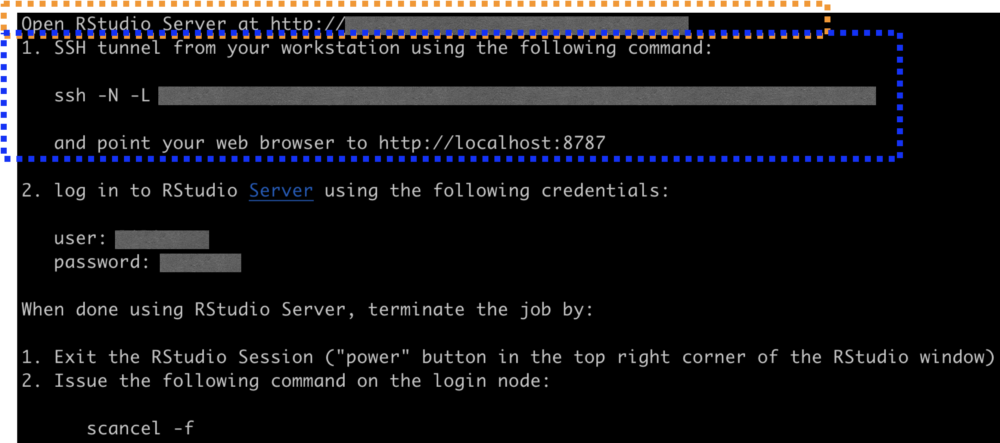

## Run studio server on RCC

Based on [integrate the container with conda](https://github.com/grst/rstudio-server-conda).

### Why this repo?

- We want to use rstudio interactively on RCC just like on our local computers. e.g. easy access to files on server, draw and check plots easily, upload and download files within rstudio, user-friendly UI.

- One way provided is through ThinLinc. But ThinLinc sometimes is slow; hard to copy-paste; not good UI, etc.

Therefore, we need another way to be able to launch rstudio on RCC.

### What is this repo?

1. This repo implements rstudio server on RCC through a singularity container.

2. Be able to run rstudio on computation node by sumbiting a SLURM job.

3. Intergrate rstudio with conda for easy package management.

### How to use this repo?

#### Git clone this repo

... to your RCC folder. I store it in my `scratch` space.

#### Load singularity

`module load singularity`

#### Modify a few parameters

To make it work for your own use, several parameters needed to modify. All modifications will be made in file `singularity/run_singularity.sh`.

1. Specify the path to a conda env to parameter `$CONDA_PREFIX`.

  This conda env store all packages you will need. You can use an existing conda env, or create a one as in file `conda_env_config.sh`.

2. Speficy the path to the rstudio singularity container to parameter `$CONTAINER`.

  - Download the container by `singularity pull docker://rocker/rstudio:latest` to get the latest version. See [here](https://www.rocker-project.org/use/singularity/) for the container's info.
  
  - Move the downloaded file `rstudio_latest.sif` to the path you assigned to `$CONTAINER`. I would recommend `singularity/rstudio_latest.sif`.

3. Set your login password to parameter `$USER_psw`.

#### Run

There are two places to run rstudio server. One is on login node, the other is on on computation node by submitting a SLURM job. I give below how to run in two ways. I would recommend running jobs on computation node as in way 2.

1. Run this container on login node.

- `bash /path/to/your_repo/singularity/run_singularity.sh`

- You will see something like highlighted in orange rectangle,

- Open the link in your browser.

  User name and password are in the figure.

2. Run studio on computation node.

- `sbatch /path/to/your_repo/singularity/run_singularity.sh`

  This is to submit a slurm job. Configure the slurm resource parameters in the header of `singularity/run_singularity.sh`.

- Check the slurm output file `rstudio-server.job`. The content is basically the same as the above figure.

  Use the info highlighted in blue rectangle.
  
  - `ssh -N -L ...` in your local terminal.
  -  Open the link in your browser.
  

### Ref and thanks to

To understand more about how this works, see ref below:

- [rstudio server singularity container](https://www.rocker-project.org/use/singularity/)

- [make it a SLURM sbatch script](https://www.rocker-project.org/use/singularity/)

- [integrate the container with conda](https://github.com/grst/rstudio-server-conda)

- Also thanks to Pheonix Mu and Chao Dai for sharing their settings.
